## **พื้นฐาน PHP**
    สรุปอ่านสอบปลายภาค

## บทเรียน
- [1.ตัวแปรและฟังก์ชันต่างๆ](#1ตัวแปรและฟังก์ชันต่างๆ)
- [2.Session ](#2session)
- [3.ch01 พื้นฐาน PHP](#3ch01-พื้นฐาน-php)
- [4.ch02 การจัดการข้อมูลจากฟอร์ม](#4ch02-การจัดการข้อมูลจากฟอร์ม)
- [5.ch03 MySQL](#5ch03-mysql)

# **1.ตัวแปรและฟังก์ชันต่างๆ**

            Slide Name = PHP 2021 เบื้องต้น 
            ใน Slide จะเน้นพวกตัวแปรและฟังก์ชัน
- 1.1 การใช้ HTML ร่วมกับ PHP
* print() กับ echo() : funtion ที่ใช้ในการแสดงข้อมูลผ่าน Browser

# **2.Session**
- **2.1 Session คืออะไร**
    * ตัวแปรคล้ายคุ้กกี้ เป็นสิ่งที่ Client สร้างขึ้นมาเมื่อเปิดเว็บ Browser และติดต่อมาที่ Web server ผ่านทาง URL
    * เมื่อ Client ทำการปิดโปรแกรม Web Browser เซสชั่น(Session) จะถูกทำลายหรือปิดลง
    * ข้อมูลที่ถูกเก็บในตัวแปร session จะถูกบันทึกเป็นไฟล์ session
    * session จะเก็บไฟล์ไว้ในฝั่ง server

- **2.2 ความแตกต่างของ Cookies กับ Session**
    * Cookies กับ Session คือ **อายุของตัวแปร**
        * `Cookies` : อายุถูกกำหนดด้วยเวลา
        * `Session` : อายุถูกกำหนดด้วยการทำงานของ Browser

- **2.3 Session มีไว้เพื่อแก้ปัญหาอะไร**
    * เพื่อแก้ปัญหาของผู้ใช้ ที่คิดว่า Cookies ไปละเมิดสิทธิส่วนบุคคล 
    * ทำให้เบราเซอร์ต่างๆ ต้องให้ผู้ใช้สามารถเลือกได้ว่าจะอนุญาตให้ใช้คุกกี้ได้หรือไม่ ถ้าผู้ใช้กำหนดไม่ยอมรับคุกกี้ ตัวแปรคุกกี้ก็ไม่มีสิทธิ์ไปสร้างไฟล์ไว้ได้ 
    * ดังนั้นจึงเกิดปัญหา หากว่าเรต้องการเก็บค่าข้อมูลเพื่อใช้ได้หลายๆครั้ง ก็จะลำบาก Session จึงช่วยแก้ปัญหาเรื่องนี้

- **2.4 ตัวอย่าง Session**

    Session| ใช้งาน |  
    :----- | ----- | 
    session_id( );  |หมายเลขประจำเครื่อง Client แต่ละเครื่องจะไม่ซ้ำกัน | 
    session_start( );|คำสั่งสำหรับการเริ่มใช้งาน seesion | 
    session_register( );| คำสั่งสำหรับประกาศตัวแปร session | 
    $_SESSION['var'] = value; | การประกาศค่าตัวแปร session | 
    session_write_close( ); |จบการ Create session | 
    unset($_SESSION['var']);  |ยกเลิก/ลบค่า Delete Session ที่ต้องการ | 
    session_destroy( );  | ยกเลิกการลบค่า Delete Session ทั้งหมด| 
    session_encode( ); |เข้ารหัส Encode Sessio | 

- **2.5 การทำงานของ session**
    * ตัวแปรจะทำงานคู่กับ session_id
    * `session_id` จะทำการเก็บตัวแปรทั้งหมดที่ถูกประกาศ Session ในหน้าปัจจุบันที่กำลังทำงานอยู่ ไว้ใช้งานในรูปแบบต่าง ๆ 
    * ค่า `Session จะหายไปประมาณ 20 นาที (default)` หลังจากที่ไม่ได้ใช้งาน
    หรือติดต่อกับ Server หรือหลังจากที่ปิด Browser 

- **2.6 การใช้งาน PHP**
    * 1.ก่อนการใช้งานตัวแปรเซสชั่น ต้องใช้คำสั่งเพื่อเปิดเซสชั่น
        <details>
        <summary>Show code</summary>

        ```ruby
            <?php
                session_start( );
                ob_start( );
            ?>
        ```
        </details>

    * 2.sample1.php // หน้ากำหนดตัวแปร session
        <details>
        <summary>Show code</summary>

        ```ruby
            <?php
                session_start( );
                ob_start( );
                $_SESSION['abc']="Hello"; //กำหนดตัวแปร
            ?>
        ```
        </details>
        
    * 3.sample2.php // หน้าแสดงตัวแปรเซสชั่น
        <details>
        <summary>Show code</summary>

        ```ruby
            <?php
                session_start( );
                ob_start( );
                echo $_SESSION['abc']; //แสดงค่าตัวแปร
            ?>
        ```
        </details>
    
    * 4.ฟังก์ชัน `ob_start()` เปิดบัฟเฟอร์การส่งออก(output) (เสริม)
        * เปิดบัฟเฟอร์การส่งออก ที่ไว้ประการใช้ output buffering จะใช้คู่กับ 
        function `ob_end_flush()`
        * บัฟเฟอร์เอาต์พุตสามารถวางซ้อนกันได้นั่นคือ
        อาจเรียกใช้ ob_start() ในขณะที่ ob_start () อีกอันทำงานอยู่

    * ตัวอย่าง
        <details>
        <summary>Show code</summary>

        ```ruby
                animal.php // กำหนดค่าเซสชั่น
                <?php
                session_start( );
                ob_start( );
                $_SESSION['animal']="cat";
                $_SESSION['color']="brown";
                ?>
                <a href="show.php">show</a>
                show.php // แสดงผลตัวแปรเซสชั่น
                <?php
                session_start( );
                ob_start( );
                echo "Hello, Your animal is ".$_SESSION['animal'].", It has ".$_SESSION['color']." color.";
                ?>
            
            ผลลัพธ์
                Hello, Your animal is Cat, It has brown color

        ```
        </details>

 - **2.7 ประโยชน์ของ Session**
    * การนำ Session มาพัฒนาเว็บ ช่วยให้ผู้ดูแลเว็บดังกล่าว`สามารถติตดาม และตรวจสอบผู้ใช้`ที่เข้ามาติดต่อกับเว็บไซต์ที่จัดทำขึนมาได้

- **2.8 การนำ Session ไปใช้**
    * การทำระบบ login สำหรับสมาชิก
    * การจำกัดการเข้าถึงหน้าเว็บ โดยผู้ที่ไม่เข้าสู่ระบบหรือไม่มีสิทธิ์ในระบบ จะทำให้ค่า session ไม่เป็นไปตามเงื่อนไข
    * การเก็บข้อมูลจากสิ่งที่ผู้ใช้เลือก


# **3.ch01 พื้นฐาน PHP**
- **3.1 PHP คือ**

     PHP ย่อมาจาก `PHP Hypertext Preprocessor`
เป็นพวกภาษา scirpting language คำสั่งต่างๆ จะถูกเก็บไว้ในไฟล์ ที่เรียกว่า สคริปต์(script)
     PHP เป็นภาษา script สามารถเขียนแทรกลงไปใน HTML ได้เลย

- **3.2 ลักษณะ PHP ที่แตกต่างจากภาษาอิ่น**
    * PHP ได้รับการพัฒนาเพื่อใช้งานในการสร้างเอกสารแบบ HTML
    * PHP เป็นภาษาที่เรียกว่า `Server-side` หรือ `HTML-embedded scirpt languag`
    * สามารถสร้างเอกสารแบบ Dynamic HTML มีประสทธิภาพสูงและมีลุกเล่นเยอะ

- **3.3 ภาษา Scirpt คืออะไร**
    * `Script` คือ ภาษาคมพิวเตอร์ที่ถูกออกแบบขึ้นโดยมนุษย์
    * วัตถุประสงค์ : เพื่อใช้ในการแปลงความคิดและแก้ไขปัญหาแบบเป็นลำดับขั้น
    * ใช้งานง่ายและไม่ซับซ้อนเหมือนโปรแกรมอื่น

- **3.4 ความแตกต่างระหว่างภาษาโปรแกรมและภาษา Script**

    ประเภท| ภาษา Scirpt |  ภาษา program 
    :----- | ----- | ----- |
    Interpreted  | ทำได้ทีละบรรทัด| ทำได้แบบรวดเดียว |
    ชั่วโมงการทำงาน| ทำงานช้ากว่าโปรแกรม| ทำงานเร็วกว่า|
    พัฒนา | เซิร์ฟเวอร์และมัลติมีเดีย| ซอฟต์แวร์ | 
    ใช้งาน | ใช้งานง่ายตัดความซับซ้อน| ซับซ้อนกว่า | 

- **3.5 การประยุกต์ใช้ภาษา Program และ ภาษา Script**
- *`ภาษา Program`*
    * รันใน parent program
    * ทำงานได้ดีกว่าเมื่อใช้กับแบบจำลองทางคณิตศาสตร์
    * บางภาษา เช่น Java สามารถ complie และนำไปใช้บน platform ไหนก้ได้
- *`ภาษา Script`*
    * คัดแยกข้อมูลที่ไม่ต้องการออกจาก dataset
    * source code ไม่ยาวและไม่เยอะ
    * ใช้สร้างคำสั่งใดคำสั่งหนึ่งในโปรแกรม

- **3.6 CGI และ Apache Module**
    - **`CGI`**
        * ตัวแปลชุดคำสั่งของ PHP ถือว่าเ็นแค่โปรแกรมภายนอก
    - **`Apache Module`**
        * ทำงานได้เร็วกว่า CGI
        * ทำงานได้มีประสิทธิภาพมากกว่า CGI
        * Apache จะเรียกมาทำงานทุกครั้งเมื่อต้องการใช้ PHP

- **3.7 รูปแบบการเขียน PHP**
- **รูปแบบ 4 รูปแบบ**
    * แบบที่ 1 การเขียนโค้ดในรูปแบบ SGML
        <details>
        <summary>Show code</summary>

        ```ruby
            <?
                คำสั่งในภาษา PHP ;
            ?>
        ```
        </details>
    * แบบที่ 2 การเขียนโค้ดเพื่อใช้ร่วมกับ XHTML หรือ XML
        <details>
        <summary>Show code</summary>

        ```ruby
            <?php
                คำสั่งในภาษา PHP ;
            ?>
        ```
        </details>
    * แบบที่ 3 การเขียนโค้ดในรูปแบบ JavaScript
        <details>
        <summary>Show code</summary>

        ```ruby
            <Script Language="php">
                คำสั่งในภาษา PHP ;
            </Script>
        ```
        </details>
    * แบบที่ 4 การเขียนโค้ดในรูปแบบ ASP

        ใช้ได้กับ php version 3.4 ขึ้นไปและจะต้องแก้ไขไฟล์ php.ini
        <details>
        <summary>Show code</summary>

        ```ruby
        <%
            คำสั่งในภาษา PHP ;
        %>
        ```
        </details>

- **3.8 เครื่องมือที่ใช้พัฒนาเว็บ**
    * XAMPP
    * PHP
    * MySQL
    * Apache

- **3.9 การใช้ Vs code**
* ติดตั้งโปรแกรม xmapp 
* ติดตั้ง Extention ของโปรแกรม
    - PHP Intelephense(จัดรูปแบบเอกสาร)
    - PHP Server(จำลองเว็บไซต์)
    - ปิดการใช้งาน(Disable): @builtin php -> PHP Language
    - PHP Intelphense
* กำหนด path ของ Windows
    - ไปที่ **System >> About >> Advanced system settings** ของ Windows
    - หน้าต่าง System Properties จะเปิดขึ้นมา **กด Environment Variables**
    - ทำการเพิ่ม path -> `C:\xampp\php\`

- **3.10 การแสดงผลด้วยคำสั่ง echo และ print**
    - *`echo`*
        * นิยมใช้กันมาก เพราะทำงานเร็ว
        * เป็นคำสั่งที่ไม่ตรวจ Error ในการส่งผลลัพธ์
            <details>
            <summary>Show code</summary>

            ```ruby
                echo('hello, world';)
                echo''Hello,PHP';
            ```
            </details>
    - *`print`*
        * ไม่นิยมใช้คำสั่ง print มากนัก
        * ทำงานช้ากว่าคำสั่ง echo
        * ตรวจสอบความผิดพลาดที่เกิดขึ้น
            <details>
            <summary>Show code</summary>

            ```ruby
                print('hello, world';)
                print''Hello,PHP';
            ```
            </details>

- **3.11 Comment ในภาษา PHP**
    * (`#`) Comment เริ่มต้นบรรทัดที่จะอธิบาย
    * (`//`) Comment 1 บรรทัด
    * `/**/` Comment มากกว่า 1บรรทัด

- **3.12 ชนิดของข้อมูลและตัวแปร**
    * การใช้ตัวแปรใน PHP จะขึ้นต้วยเครื่องหมาย `dollar($)`
    * ไม่จำเป็นต้องกำหนดแบบของข้อมูล(data type) เพราะตัวแปลภาษาจะจำแนกเองได้โดยอัตโนมัติ

    ประเภท| ใช้งาน 
    :----- | ----- | 
    Integer | จำนวนเต็มบวก,จำนวนเต็มลบ เลขฐานสิบ ฐานแปด ฐานสิบหก| 
    Float| จำนวนจริงบวกและลบ ทศนิยมและไม่ทศนิยม| 
    String | จำนวนตัวเลข และ ข้อความ|  
    Array | ข้อมูลเป็นชุด หรือ อาร์เรย์| 
    Object | ข้อมูลในลักษณะ Object เพื่อการเรียกใช้เป็น Class Object หรือ Function | 
    Type juggling | ข้อมูลในลักษณะเฉพาะหรือที่ผู้ใช้เพิ่มเข้ามา| 

- **3.13 การประกาศตัวแปร**
    * ต้องมีเครื่องหมาย dollar($) กำกับไว้หน้าตัวแปรเสมอ เช่น $name,$value
    * อักขระที่นำมากำหนดชื่อตัวแปร คือ a-z, A-Z, 0-9 หรือ _ เท่านั้น
    * ตัวแรกของตัวแปรห้ามขึ้นต้นด้วยเลข 0-9
    * อักษรพิมพ์ใหญ่ พิมพ์เล็ก ถือว่าเป็นคนละตัวกัน

 - **3.14 การกำหนดค่าให้กับตัวแปร**
    - *ข้อมูลชนิดตัวเลข (Number)*
        <details>
        <summary>Show code</summary>

        ```ruby
            $x = 123;
        ```
        </details>
           
    - *ข้อมูลชนิดสตริง (String)*
        <details>
        <summary>Show code</summary>

        ```ruby
            $phone = "080-xxxxxxx";
        ```
        </details>
           
           
    - *ข้อมูลชนิดบูลีน (ฺBoolean)*
        <details>
        <summary>Show code</summary>

        ```ruby
            $first_time = time;
            $is_valid = false;
        ```
        </details>
    - *ตัวแปรที่มีค่า null*
        <details>
        <summary>Show code</summary>

        ```ruby
            $a;
            $b= null;
        ```
        </details>
- **3.15 การตรวจสอบตัวแปรและยกเลิกตัวแปร**
    - *isset (ตัวแปร)*
        * ตรวจสอบว่ามีตัวแปรตามที่ระบุมั้ย หรือ ได้สร้างตรวจแปรนั้นขึ้นมา แล้วหรือยัง
        * หากมีจริงและไม่เป็น null จะได้ค่าเป็น true
        * หากไม่มีตัวแปรดังกล่าวหรือตัวแปรมีค่าเป็น null จะคืนค่า false
            <details>
            <summary>Show code</summary>

            ```ruby
                $x = 123;
                $a = isset($x); //$a = true มีค่าตัวแปรจริงค่าไม่เป็น null
                $y = null; //ค่าเป็น null ส่งคืนค่า fasle
                $b = isset($y); //$b = false  b ตรวจสอบการมีตัวแปรของ y
                $c = isset($z); //$c = false เพราะยังไม่ได้กําหนดตัวแปร $z
            ```
            </details>
    - *is_null (ตัวแปร)*
        * ตรวจสอบว่าตัวแปรมีค่าเป็น null มั้ย
    - *empty (ตัวแปร)*
        * ตรวจสอบว่าตัวแปรนั้นมีค่ามั้ย (PHP จะถือว่าเป็นตัวแปรที่ว่างเปล่า)
        * ตัวแปรที่มีค่า
            * มีค่าเป็น null
            * มีค่าเป็น String
            * มีค่าเป็น 0
            * มีค่าาเป็น false
        * ถ้าตัวแปรมีค่าว่างเปล่า ฟังก์ชันนี้จะได้ผลลัพธ์เป็น true
            <details>
            <summary>Show code</summary>

            ```ruby
                $x = ‘ ‘;
                $a = empty($x); //$a = true
                $y = 0;
                $b = empty($y); //$b = true
                $c = empty($z); //$c = true เพราะยังไม่ได้กําหนดตัวแปร $z

            ```
            </details>
    - *unset (ตัวแปร_1,ตัวแปร_2)*
        * ใช้ยกเลิกตัวแปรที่ระบุ เพื่อคืนทรัพยากรให้แก่ระบบ
        * เราสามารถยกเลิกตัวแปรได้หลายตัวพร้อมกัน
            <details>
            <summary>Show code</summary>

            ```ruby
                $a = 123;
                $b = ‘php’;
                unset($a, $b);
                echo $b; //เกิดข้อผิดพลาด เพราะตัวแปร $b ถูกยกเลิกแล้ว
            ```
            </details>   
- **3.16 ค่าคงที่**
    * ตัวแปรที่ใช้เก็บข้อมูลค่าใดค่าหนึ่ง ไม่สามารถเปลี่ยนค่าได้ภายหลัง
    * ค่าคงที่ไม่ต้องเขียนเครื่องหมาย $ แต่จะกำกับด้วยคำสั่ง
    
        คำสั่ง| การใช้งาน  |
        :----- | ----- | 
        define ('ชื่อค่าคงที่',ค่าที่กำหนด)  | สร้างค่าคงที่ |
        define ('ชื่อค่าคงที่')| ใช้ตรวจสอบว่ามีค่าคงที่ตามชื่อที่ระบุไว้มั้ย| 
        constant ('ชื่อค่าคงที่')| ใช้ในการอ่านค่าคงที่เพื่อนำไปใช้|

- **3.17 โอเปอเรเตอร์**
    * โอเปอเรเตอร์สำหรับการเชื่อต่อสตริง จะใช้เครื่องหมายจุด ( . ) ในการเชื่อมต่อ
        <details>
        <summary>Show code</summary>

        ```ruby
        $str = ‘Maria’.”DB”; //$str = “MariaDB”
        echo ‘มาลี’.’ ‘.’มีลา’ //มาลี มีลา
        $fname = ‘John’;
        $lname = ‘Smith’;
        echo ‘My name is ‘.$fname.’ ‘.$lname; //My name is John Smith
        echo 1 . 2 . 3; //123 ห้ามเขียนติดกัน จะได้เป็น 1.2.3

        ```
        </details>
    * โอเปอเรเตอร์สำหรับการคำนวณ
        <details>
        <summary>Show code</summary>

        ```ruby
            1. = : กำหนดค่า เช่น $x=10;
            2. += : ค่าที่กำหนดบวกค่าเดิมตัวแปร เช่น $x=10; $x+=8; //$x=18
            3. -= : ค่าเดิมตัวแปรลบค่าที่กำหนด เช่น $x=10; $x-=8; //$x=2
            4. *= : ค่าเดิมตัวแปรคูณค่าที่กำหนด เช่น $x=10; $x*=8; //$x=80
            5. /= : หารค่าเดิมของตัวแปรด้วยค่าที่กำหนด เช่น $x=10; $x /=5; //$x=2
            6. %= : ค่าที่ระบุหารด้วยค่าของตัวแปร แต่เอาแค่ค่าที่เหลือจากการหาร เช่น $x=10; $x /=3; //$x=1
            7. **= : ยกกำลังด้วยค่าเดิมของตัวแปร เช่น $x=9; $x **=2; //$x=81
            8. .= : ใช้เชื่อมต่อ string เช่น $x = ‘PHP’; $x .= ‘/MariaDB’; //$x = ‘PHP/MariaDB’

        ```
        </details>

# **4.ch02 การจัดการข้อมูลจากฟอร์ม**
- **4.1 โครงสร้างเบื้องต้น**
    <details>
    <summary>Show Structure</summary>
        
    ```ruby
        <form แอดทริบิวต์>
            อิลิเมนต์ต่างๆ
        </form>
    ```
    </details>

- **4.2 ข้อกําหนดของ Attribute ที่สําคัญ**
    * ประเภทต่าง
        Attribute | การใช้งาน  |
        :----- | ----- | 
        method | รูปแบบในการส่งข้อมูล โโยกำหนดเป็น post หรือ get|
        action| เพจปลายทางที่จะรับข้อมูล| 
        target| เป้าหมหายการส่งข้อมูลออกไป|
    * ประเภท targrt
        ประเภท targrt | การใช้งาน  |
        :----- | -----| 
        _self| ส่งผ่านเพจปัจจุบันที่บรรจุฟอร์ม(default)|
        _blank| ส่งโดยเปิดเพจหรือเปิดแท็บใหม่| 
        _top| ส่งแบบเต็มเพจ มักใช้เมื่อฟอร์มนั้นอยู่ในเฟรม|
        <frame.>| ส่งผ่านเฟรมที่กำหนด|

- **4.3 ข้อกำหนดเบื้องต้นของ Form**
    * ถ้าส่งข้อมูลไปฝั่ง Server ควรกำหนด Attribute **method** และ **action** เสมอ
    * ถ้าไม่กำหนด Attribute method ฟอร์มจะเลือกส่งข้อมูลแบบ **get**
    * ลักษณะสำคัญของ Attribute *method=get* 
        * ข้อมูลบน Elements ของฟอร์มจะถูกแปลงให้อยู่ในรูปแบบ Qurey String แล้วแบต่อท้าย URL เพื่อส่งไปยังเพจปลายทาง
        * ข้อมูลที่แนบท้าย URL มองเห็นได้ จึงไม่เหมาะกับข้อมูลที่ต้องการความปลอดภัย
        * จำนวนอักขระ Qurey String ต้องรวมกันไม่เกิน 256 ตัว
    * ลักษณะที่สำคัญของ  Attribute *method=post*
        *  ข้อมูลบน Elements **ไม่แนบต่อท้าย URL** แบบ Qurey String จึงมีความปลอดภัยกว่า
        * สามารถส่งข้อมูลได้แบบไม่จำกัด

- **4.4 ตัวอย่างการกำหนด Attribute ของฟอร์ม**
    <details>
    <summary>Show Structure</summary>
            
    ```ruby
        <form method=“post” action=“test.php” target=“_blank”>
            ....
        </form>
        // method=post รูปแบบการส่งข้อมุลแบบ post(ส่งข้อมูลได้ไม่จำกัด ปลอดภัย)
        // action=test เพจปลายทางที่จะรับข้อมูล
        // target=_blank เป้าหมาย,ผลลัพธ์การส่งออกข้อมูล _blank(ส่งโดยเปิดเพจหรือเปิดแท็บใหม่)
    ```
    </details>

- **4.5 Elements ของฟอร์ม**
    * คำสั่ง <.INPUT Attribute.> เป็นคำสั่งในการกำหนดรูปแบบฟอร์มที่ใช้สำหรับการรับข้อมูล
        <details>
        <summary>Show Elements</summary>
            
            1.NAME : รูปแบบคำสั่ง <.INPUT NAME=Name.> , Name=ใช้กำหนดชื่อ ,Name=ชื่อไฟล์ที่ใช้เก็บข้อมูลในแต่ละรายการ
            2.SIZE : รูปแบบคำสั่ง <.INPUT SIZE=Number.> , SIZE=ใช้กำหนดขนาด , Number= ขนาดความยาวของตัวอักษรที่จะให้รับข้อมูลได้
            3.MAXLENGTH : รูปแบบคำสั่ง <.INPUT MAXLENGTH=Number.> , MAXLENGTH=ใช้กำหนดความยาวสูงสุดของข้อมูล ,Number=เลขจำนวนสูงสุดที่กำหนดให้สามารถรับข้อมูลได้
            4.VALUE : รูปแบบคำสั่ง <.INPUT VALUE=Message.> , VALUE=ใช้กำหนดค่า ,Message= ข้อความ หรือ ค่า ที่ต้องการระบุไว้ในช่องรับข้อมูล
            5.TYPE : คำสั่ง <.INPUT TYPE.> เป็นคำสั่งในการกำหนดชนิดข้อมูล
                    
        </details>
    
    * คำสั่ง <.INPUT TYPE.> เป็นคำสั่งที่ใช้ในการกำหนดชนิดข้อมูล
        
        INPUT TYPE | การใช้งาน  |
        :----- | ----- | 
        text |ช่องรับข้อความแบบบรรทัดเดียว|
        password|ช่องรับข้อมความที่เป็นรหัส| 
        checkbos| ตัวเลือกที่สามารถเลือกได้มากกว่า 1 รายการ| 
        radio|ตัวเลือกที่เลือกได้เพียง 1 รายการ| 
        file|กำหนดไฟล์ที่อัพโหลด|
        submit|ปุ่มสำหรับส่งข้อมูลจาก Form ไปยัง Server |
        reset|ปุ่มสำหรับยกเลิกข้อมูลทั้งหมดใน Form |
        hidden|ใช้สำหรับเก็บซ่อนข้อมูลที่ไม่ต้องการให้ผู้ใช้เห็น |
        image|สำหรับใช้รูปภาพเป็นปุ่มสั่งงาน|
        button|ปุ่มสั่งงานทั่วไป ส่วนใหญ่ใช่ร่วมกับ Javascript |
        number|รับข้อมูลเป็นตัวเลข |
        email|รับข้อมูลเป็นอีเมล |
        url|รับข้อมูล URL |
        date|ข้อมูลที่เป็นวันเดือนปี ในรูปแบบ:ปี-เดือน-วัน |
        datetime|ใส่วันที่และเวลา |
        month|ใส่เดือนและปี 
        color|ใส่ค่าสี |
        <.textarea.>|ช่องรับข้อความแบบหลายบรรทัด |
        <.select.>|สร้างรายตัวเลือกแบบ dropdown,list|
        
- **4.6 การอ่านข้อมูลจาก Form**
    * การอ่านข้อมูลที่ถูกส่งจากฟอร์ม
    
        method | การใช้งาน  |
        :----- | ----- | 
        $_GET ['ชื่อ'] |อ่านข้อมูลที่ถูกส่งมาด้วย method GET โดย 'ชื่อ' คือ  Attribute name ของ Elements ที่ต้องการอ่านข้อมูล  |
        $_POST ['ชื่อ']|อ่านข้อมูลด้วย method POST| 
        $_REQUEST ['ชื่อ']|อ่านข้อมูลไม่ว่าจะเป็น POST หรือ GET| 
        $_SERVER ['REQUESR_METHOD']|ตรวจสอบว่าข้อมูลถูกส่งด้วย method ใด|

    * การส่งข้อมูลแบบ **Postback**
        * การสร้างทั้งฟอร์มและส่วนสคริปต์ PHP ที่ใช้จัดการข้อมูลจากฟอร์มไว้ในเพจเดียวกัน

# **5.ch03 MySQL**
- **5.1 ภาษา SQL คือ**
    * สามารถสร้างและและปฏิบัติกับฐานข้อมูลเชิงสัมพันธ์ได้โดยเฉพาะ `Structuer Query Language `
    * สำหรับใช้กับ Relational Database :`ระบบฐานข้อมูลเชิงสัมพันธ์` เป็นการเก็บข้อมูลในรูปของตาราง (table)
    * อยู่ในรูปแบบภาษาอังกฤษ

- **5.2 ประเภทของคำสั่งภาษา SQL**
    1. ภาษาสำหรับการนิยามข้อมูล(Data Definition Language : DDL)
    2. ภาษาสำหรับการจัดการข้อมูล (Data Manipulation Language : DML)
    3. ภาษาควบคุม (Data Control Language : DCL)

- **5.3 ภาษาสำหรับการนิยามข้อมูล(Data Definition Language : DDL)**
    * กลุ่มคำสั่งที่ใช้กระทำกับโครงสร้างฐานข้อมูล
        <details>
        <summary>ตัวอย่างคำสั่ง</summary>
                    
        ```ruby
            CREATE : ใช้สร้างตาราง
            ALTER  : ใช้แก้ไข/เปลี่ยนแปลงตาราง
            DROP   : ใช้สำหรับตาราง
        ```
        </details>
    - **5.3.1 ชนิดของข้อมูลที่ใช้ในภาษา SQL**
        1. ข้อมูลตัวเลข
        2. ข้อมูลวันเวลา
            <details>
            <summary>ตัวอย่างคำสั่ง</summary>
                
                    1.DATE : ขนาดที่เก็บ 3 Bite, รูปแบบ(ปี-เดือน-วัน)
                    2.DATETIME : ขนาดที่เก็บ 8 Bite, รูปแบบ(ปี-เดือน-วัน ชม.-นาที-วินาที)
                    3.TIMESTAMP : ขนาดที่เก็บ 4 Bite, เก็บวันที่และเวลาในรูปแบบ String Timestamp
                    4.TIME : ขนาดที่เก็บ 3 Bite, เก็บค่าเวลาในรูปแบบ(ชั่วโมง-นาที-วินาที)
                    5.YEAR[(2 หรือ 4)] : ขนาที่เก็บ 1 Bite, เก็บค่าปี 2 หรือ 4 หลัก
                
            </details>
        3. ข้อมูลตัวอักษร
            <details>
            <summary>ตัวอย่างคำสั่ง</summary>
                
                1.char :  ขนาดที่เก็บไม่เกิน 255 Bite
                2.varchar : ขนาดที่เก็บตามข้อมูลจริง แต่ไม่เกิน 255 Bite
                    char=เก็บข้อมูลตายตัว , varchar=เก็บตามข้อมูลจริง
        
                3.tinyblob/tinytext : ขนาดที่เก็บตามข้อมูลจริง +1 Bite
                4.BLOB/TEXT : ขนาดที่่เก็บตามข้อูลจริง +2 Bite
                5.Mediumblob/Mediumrtext : ขนาดที่เก็บข้อมูลตามจริง +3 Bite
                6.Longblob/Longtext : ขนาดที่เก็บตามข้อมูลจริง +4 Bite
                7.enum('value1','value2',..) : ขนาดที่เก็บ 1 หรือ 2 Bite ตามจำนวนค่า value
                8.set('value1','value2',..) :  ขนาดที่เก็บ 1,2,3,4 หรือ 8 Bite ตามจำนวนค่า value
                    enum=เก็บค่า value เพียงค่าเดียวต่อ 1 แถว , set=สามารถเก็บ value ได้หลายค่าต่อ 1 แถว
            
            </details>
    - **5.3.2 การใช้ภาษาไทยในภาษา SQL**
        * การสร้าง `Table` หรือสร้าง `Field` ให้ใช้เป็น `utf8_unicode_ci`
        Ref.
        * การ `Import` หรือ `Export` ข้อมูลก็ต้องใช้ utf8

- **5.4 ภาษาสำหรับการจัดการข้อมูล (Data Manipulation Language : DML)**
    * กลุ่มคำสั่งที่กระทำกับฐานข้อมูล
        <details>
        <summary>ตัวอย่างคำสั่ง</summary>
                            
        ```ruby
            SELECT : ใช้เรียกข้อมูลมาแสดงผล 
            INSERT : ใช้เพิ่มข้อมูลเข้าไปในตาราง
            UPDATE : ใช้แก้ไขข้อมูลในตาราง
            DELETE : ใช้ลบข้อมูลในตาราง
        ```
        </details>
- **5.4.1 รูปแบบคำสั่งและการใช้งาน SELECT**       
    * 1.1 SELECT<การเรียกดูข้อมูล> : ใช้เรียกข้อมูลมาแสดงผล 
        
        รูปแบบ `SELECT * FROM ชื่อตาราง;`
                
    * 1.2 SELECT<การเรียกดูข้อมูลเฉพาะบางแถวที่ตรงตามเงื่อนไข>
        <details>
        <summary>ตัวอย่างคำสั่ง</summary>
                                        
        ```ruby
            SeLECT First_name,Last_name,Address
            From Employess
            WHERE Address ='อุตรดิตถ์'//เงื่อนไขว่าต้องอยู่ใน อุตรดิตถ์

        ```
        </details>
        
- **5.4.1.2 Operator (ตัวปฏิบัติการ) ที่ใช้ใน Where**
    * 1.Special operators
        <details>
        <summary>Show Image</summary>
                                                
        <center>  </center>
      </details>
    
    * 2.การใช้ And : และ
        <details>
        <summary>Show Image</summary>
                                                
        <center>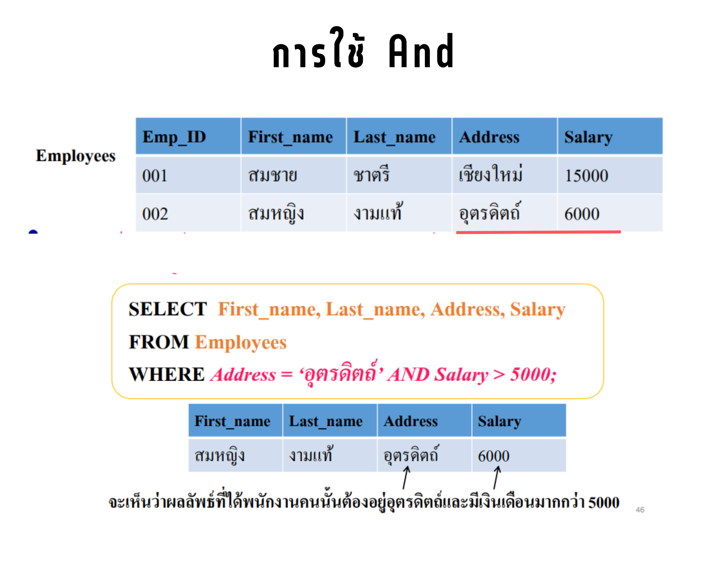  </center>
      </details>
    
    * 3.การใช้ OR : หรือ
        <details>
        <summary>Show Image</summary>
                                                
        <center>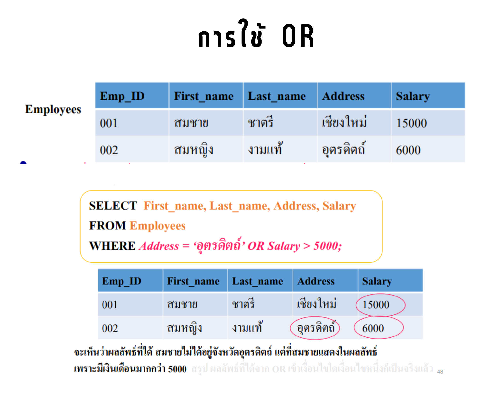  </center>
      </details>
    
    * 4.การใช้ Between...And.. : ระหว่าง..และ..
        <details>
        <summary>Show Image</summary>
                                                    
        <center>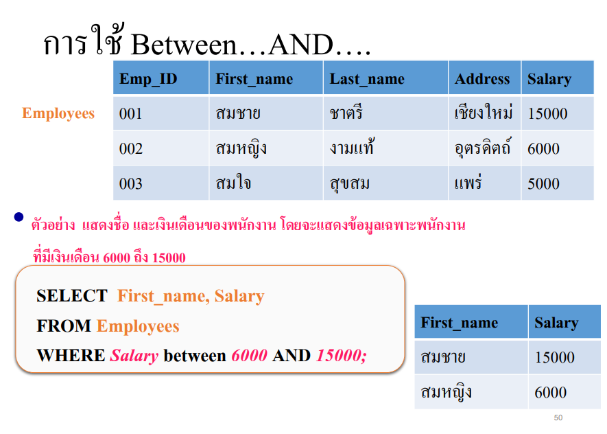  </center>
        </details>

    * 5.การใช้ Not Between..And.. : ไม่อยู่ในระหว่าง..และ..
        <details>
        <summary>Show Image</summary>
                                                        
        <center>  </center>
        </details>

    * 6.การใช้ IN : ข้อมูลที่อยู่ใน
        <details>
        <summary>Show Image</summary>
                                                            
        <center>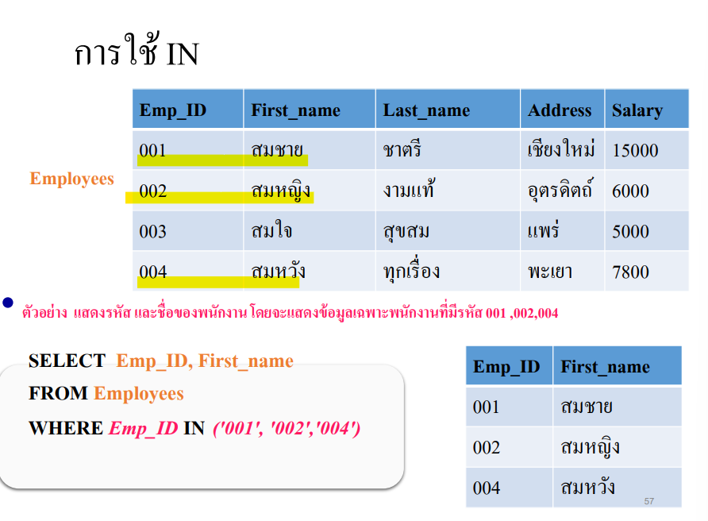  </center>
        </details>
    * 7.การใช้ Not IN : ข้อมูลไม่อยู่ใน
        <details>
        <summary>Show Image</summary>
                                                                
        <center>  </center>
        </details>
    * 8.การใช้ IS NULL : เช็คข้อมูลที่ไม่ได้ระบุ
        <details>
        <summary>Show Image</summary>
                                                                    
        <center>  </center>
        </details>
    * 9.การใช้ IS NOT NULL : เช็คข้อมูลที่มีการระบุ ไม่เป็นค่า NULL
        <details>
        <summary>Show Image</summary>
                                                                        
        <center>  </center>
        </details>
    * 10.การใช้ Like : หาสิ่งที่ต้องการค้นหา จะอยู่หลังคำว่า Like
        <details>
        <summary>Show Image</summary>
                                                                        
        <center>  </center>
         <center>  </center>
        </details>
    * 11.การใช้ Not Like : สิ่งที่ค้นหาต้องไม่อยู่หลัง like
        <details>
        <summary>Show Image</summary>
                                                                            
        <center>  </center>
            
        </details>
    * 12.การใช้ DISTINDT : แสดงผลค่าที่ซ้ำกันเพียง 1 ค่า แล้วนำค่ามาเรียงใหม่
        <details>
        <summary>Show Image</summary>
                                                                        
        <center>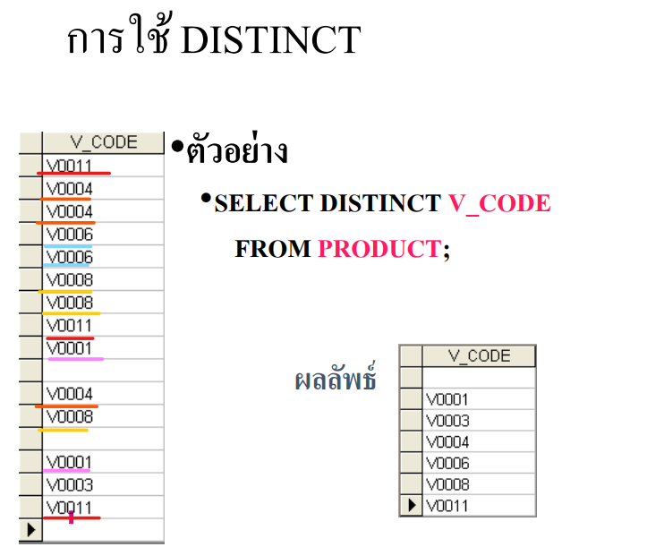  </center>
        <center>  </center>       
        </details>
    * 13.การใช้ EXISTS : ตรวจสอบข้อมูล 2 ตารางว่ามีข้อมูลเหมือนกันมั้ย
        <details>
        <summary>Show Image</summary>
                                                                            
        <center>  </center>
                
        </details>

    * 14.การใช้ ORDER BY : จัดเรียงลำดับในการแสดงผล
        * `ASC คือ เรียงจากน้อยไปมาก` , `DESC คือ เรียงจากมากไปน้อย`
        <details>
        <summary>Show Image</summary>
                                                                            
        <center>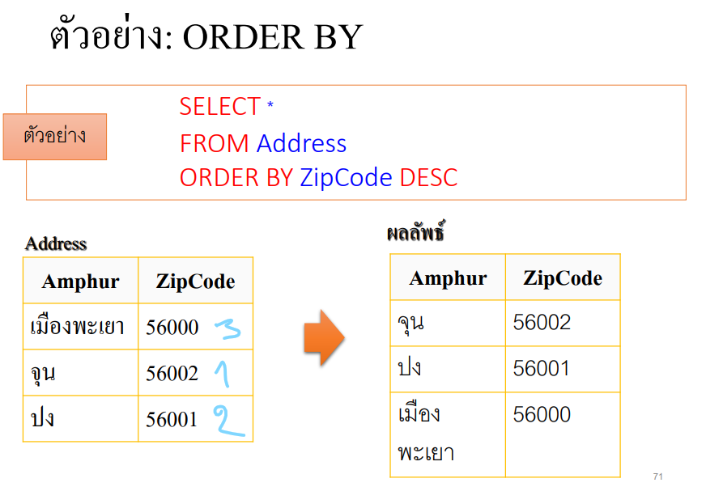  </center>
                
        </details>

- **5.4.2 รูปแบบคำสั่งและการใช้งาน INSERT**
    * INSERT: เพิ่มแถว(Row) ลงใน Table
    * ตัวอย่างการใช้ INSERT
        <details>
        <summary>Show Image</summary>
                                                                        
        <center>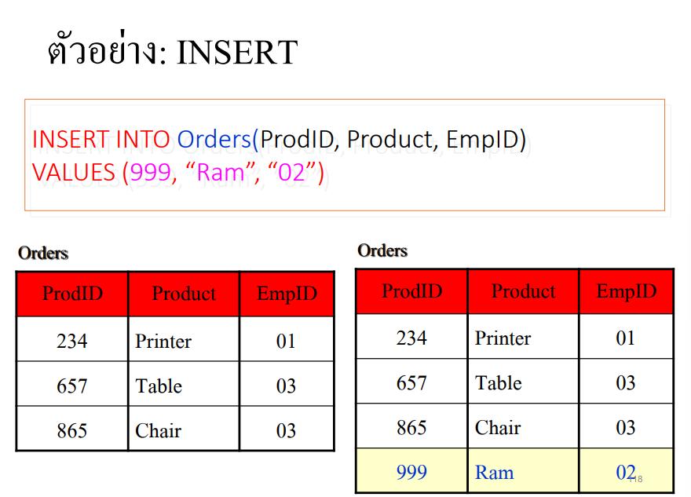  </center>
                
        </details>

- **5.4.3 รูปแบบคำสั่งและการใช้งาน UPDATE**
    * UPDATE : แก้ไขข้อมูลในตาราง
    * ตัวอย่างการใช้ UPDATE
        <details>
        <summary>Show Image</summary>
                                                                            
        <center>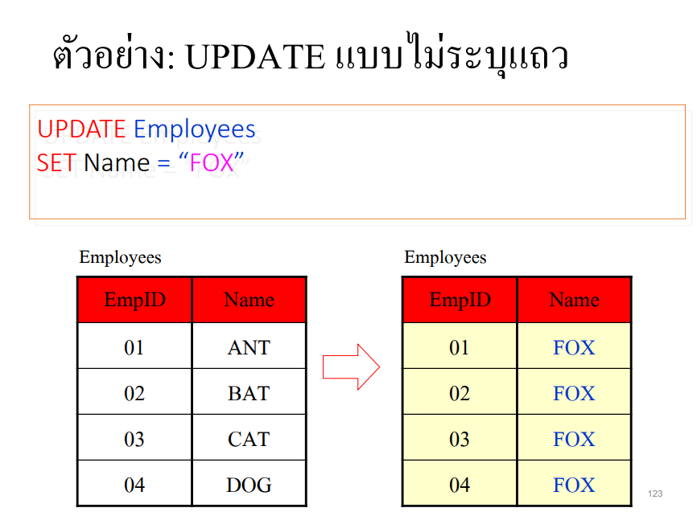  </center>
        <center>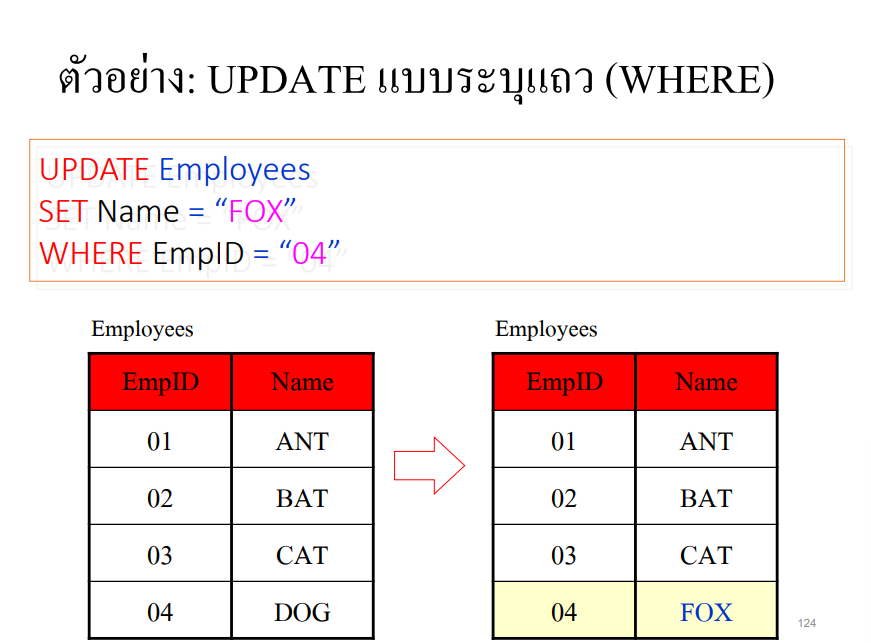  </center>           
        </details>

- **5.4.4 รูปแบบคำสั่งและการใช้งาน DELETE**
    * DELETE : ลบแถว(Row) ออกจากตาราง
    * ตัวอย่างการใช้ DELETE
        <details>
        <summary>Show Image</summary>
                                                                                
        <center>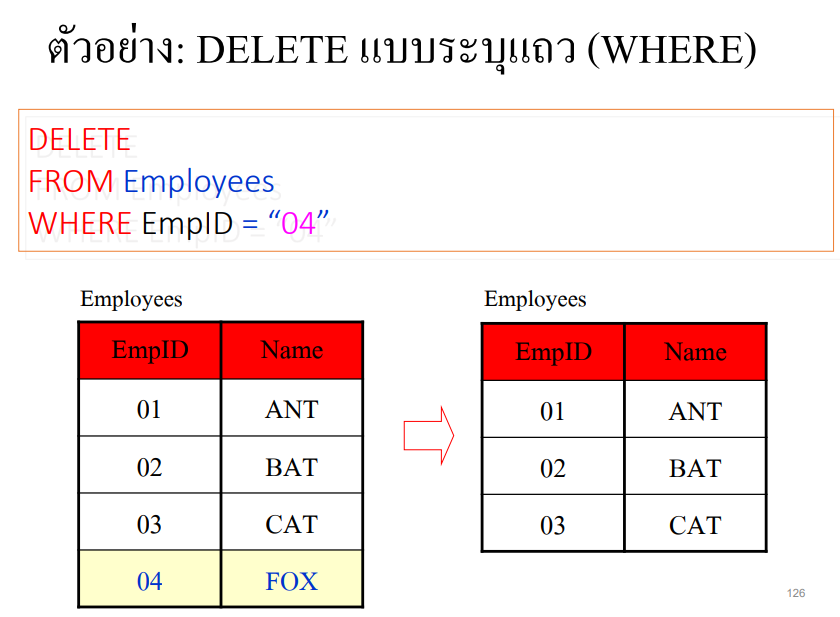  </center>
        <center>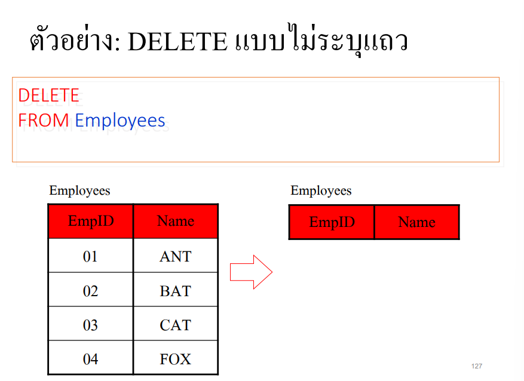  </center>           
        </details>

- **5.5 ภาษาควบคุม (Data Control Language : DCL)**
* เป็นคำสั่งที่ใช้ในการกำหนดสิทธิการใช้งานในฐานข้อมูล
* ตัวอย่างคำสั่ง
    * GRANT เป็นคำสั่งให้สิทธิผู้ใช้(๊USER)

- **5.6 ฟังก์ชันใน SQL**
- **5.6.1 ฟังก์ชันเดี่ยว(Single Row function)**
    * ฟังก์ชันในการจัดการตัวอักษร มี 2ประเภท
        * Case-manipulation functions
            <details>
            <summary>Show Image</summary>
                                                                                    
            <center>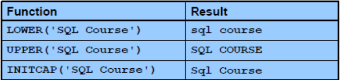  </center>
            <center>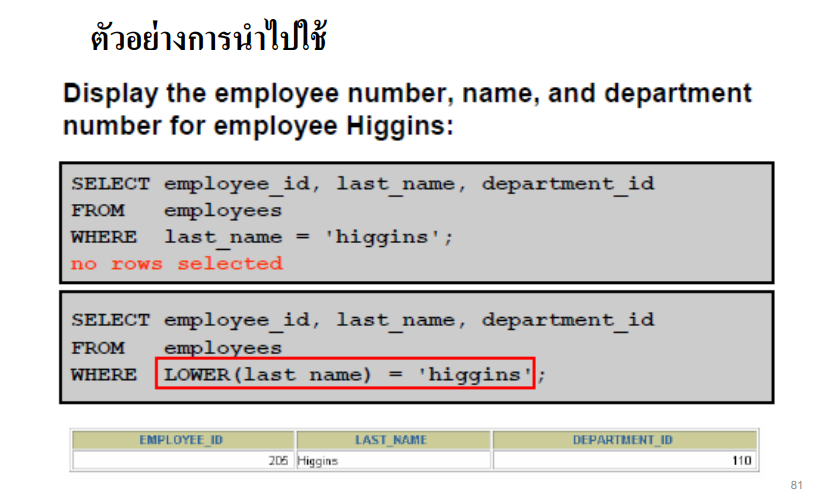  </center>             
            </details>

        * Character-manipulation functions
            <details>
            <summary>Show Image</summary>
                                                                                    
            <center>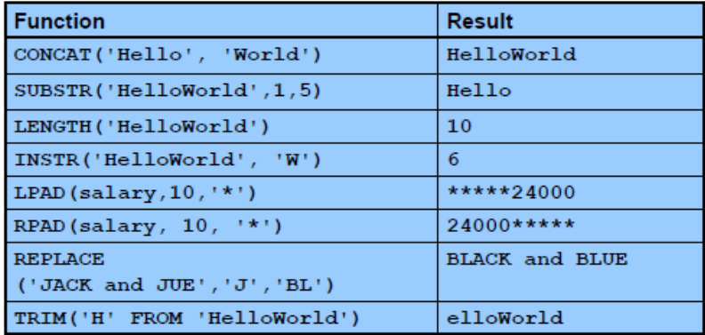  </center>
            <center>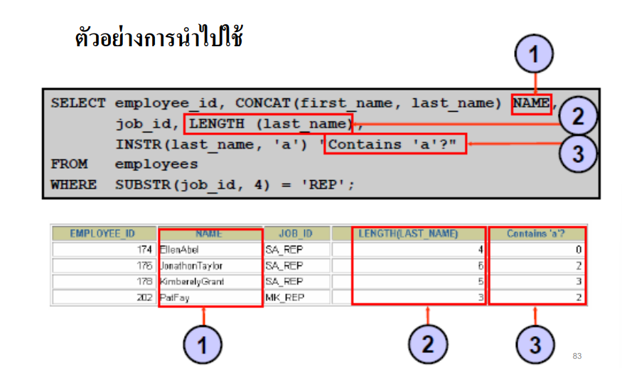  </center>             
            </details>

    * ฟังก์ชันเกี่ยวกับตัวเลข
        <details>
        <summary>Show คำสั่ง</summary>
                                                                                
        ```ruby
            1.ROUND : ปัดเศษทศนิยม ตามจำนวนตำแหน่งที่ระบุ โดยคำนึงถึงทศนิยมด้วยว่าจะปัดขึ้นหรือลง
            2.TRUNC : ปัดเศษทศนิยมทิ้ง ตามจำนวนตำแหน่งที่ระบุ
            3.MOD : หารเอาเศษที่เหลือมาตอบ
        ```        
        </details>

    * ตัวอย่างการใช้
        <details>
        <summary>Show Image</summary>
                                                                                
        <center>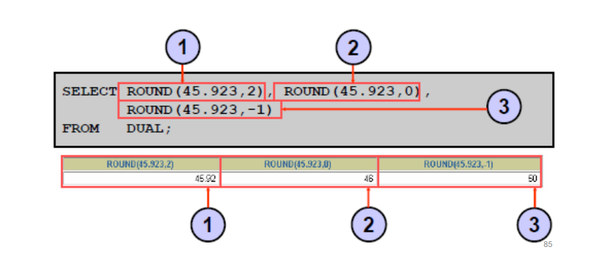  </center>     
        <center>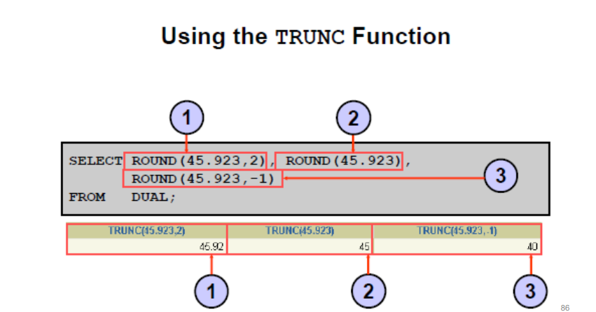  </center>
        <center>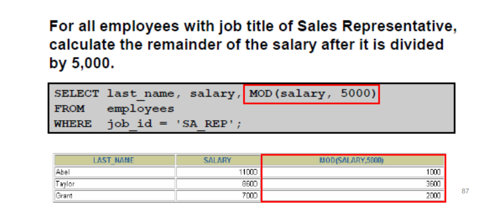  </center>         
        </details>

    * ฟังก์ชันเกี่ยวกับเวลา
        * SYSDATE : คำสั่งที่ใช้ในการ`อ่านวันที่ปัจจุบัน`ของ Oracle Database
        <details>
        <summary>Show Image</summary>
                                                                                
        <center>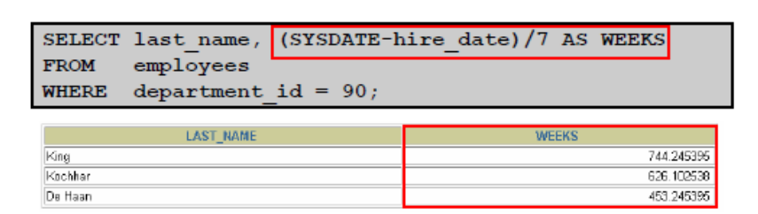  </center>     
        <center>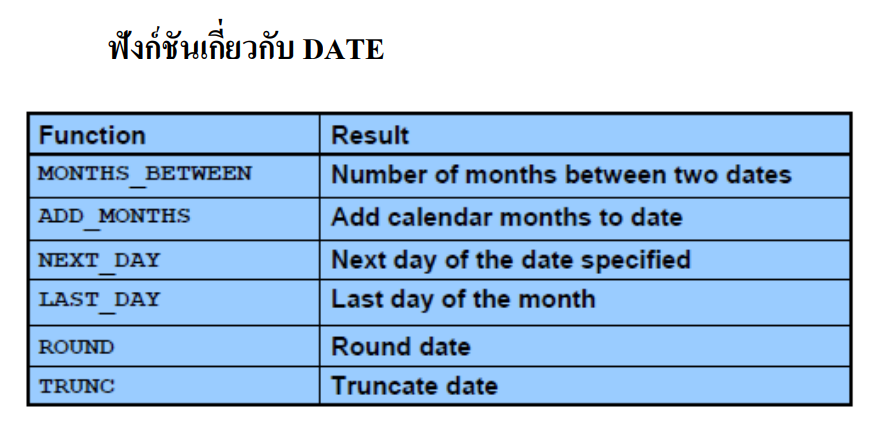  </center>
        <center>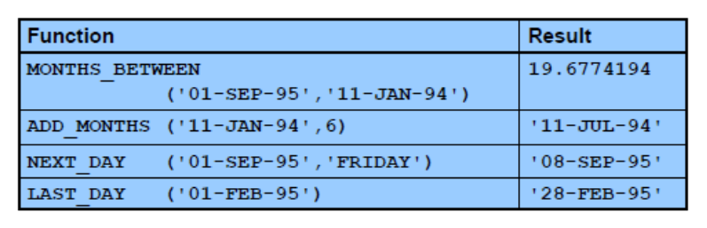  </center>         
        </details>
    
    * ฟังก์ชันสรุป (Aggregate function)
    


 - https://saixiii.com/database-sql-data-types/ (ชนิดข้อมูล)
